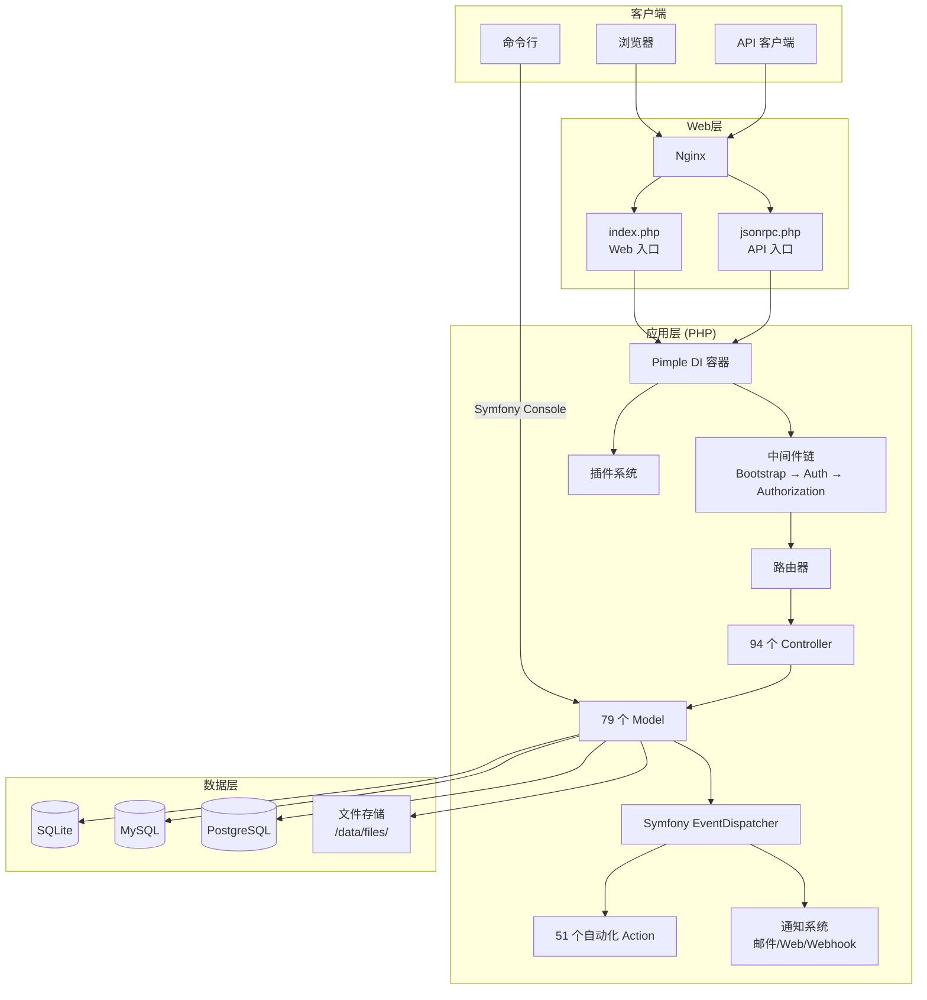

# 第一章：项目概览

## 1.1 Kanboard 是什么

Kanboard 是一个开源的**看板项目管理工具**（Kanban Project Management Software）。它的核心理念是通过可视化的看板（Board）帮助团队管理任务流转，强调"限制在制品数量"（WIP Limit）以提升工作效率。

**它解决的核心问题**：
- 团队需要一个轻量的、可自托管的任务管理工具
- 需要看板视图来可视化工作流
- 需要自动化规则来减少手动操作
- 需要足够的 API 能力与其他系统集成

**propress/fork-kanboard** 是 Kanboard 的一个 fork 版本，基于上游 `kanboard/kanboard` 做了定制和维护。

---

## 1.2 技术栈一览

| 层级 | 技术选型 | 说明 |
|------|----------|------|
| **语言** | PHP ≥ 8.1 | 后端全部用 PHP 编写 |
| **Web 服务器** | Nginx + PHP-FPM | Docker 镜像中默认配置 |
| **数据库** | SQLite / MySQL / PostgreSQL | 三种均支持，SQLite 为默认 |
| **DI 容器** | Pimple 3.6 | 轻量级依赖注入容器 |
| **事件系统** | Symfony EventDispatcher | 事件发布/订阅机制 |
| **CLI 工具** | Symfony Console 5.4 | 命令行任务（迁移、定时任务等） |
| **API 协议** | JSON-RPC 2.0 | 通过 `jsonrpc.php` 入口提供 |
| **认证** | 数据库 / LDAP / 反向代理 / 2FA (TOTP) | 多种认证方式可组合 |
| **模板引擎** | 原生 PHP 模板 | 无第三方模板引擎 |
| **邮件** | SMTP / Sendmail / PHP mail() | 通知邮件发送 |
| **二次验证** | christian-riesen/otp 1.4 | TOTP 实现 |
| **日志** | PSR-3 (psr/log 1.1) | 支持 syslog/stderr/file |

---

## 1.3 技术栈架构图

---

## 1.4 部署方式

### Docker 部署（推荐）

项目提供基于 **Alpine 3.23** 的 Docker 镜像，内置：
- PHP 8.4 + FPM
- Nginx（含 SSL 支持）
- 多数据库驱动（SQLite、MySQL、PostgreSQL）
- LDAP 扩展
- 健康检查端点（`/healthcheck.php`）

提供三种 `docker-compose` 配置：
- `docker-compose.sqlite.yml` — 默认，零配置启动
- `docker-compose.mysql.yml` — 搭配 MySQL 容器
- `docker-compose.postgres.yml` — 搭配 PostgreSQL 容器

**数据持久化卷**：
- `/var/www/app/data` — SQLite 数据库 + 上传文件
- `/var/www/app/plugins` — 插件目录
- `/etc/nginx/ssl` — SSL 证书

### 直接部署

**环境要求**：
- PHP ≥ 8.1，需启用扩展：`gd`、`mbstring`、`openssl`、`json`、`xml`、`pdo`、`session`
- Web 服务器（Apache / Nginx）
- 数据库（SQLite 无需额外安装）

**步骤概要**：
1. 将代码部署到 Web 目录
2. 确保 `data/` 目录可写
3. 访问根 URL 即可使用（首次自动创建数据库）
4. 可选：创建 `config.php` 覆盖默认配置

### 配置优先级

配置加载顺序（高优先级 → 低优先级）：
1. `/data/config.php` — 运行时配置（Docker 场景常用）
2. `/config.php` — 项目根目录用户配置
3. `config.default.php` — 默认配置（所有可配置项的参考）
