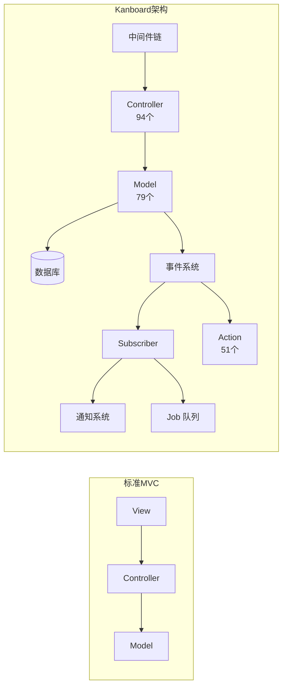
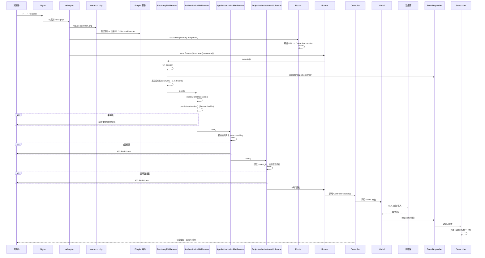
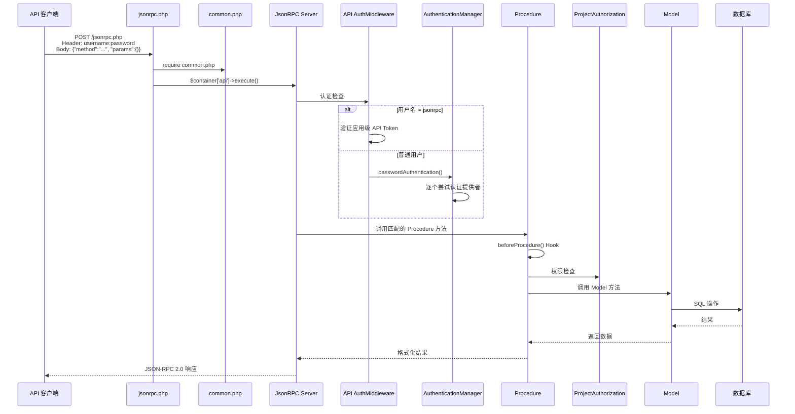
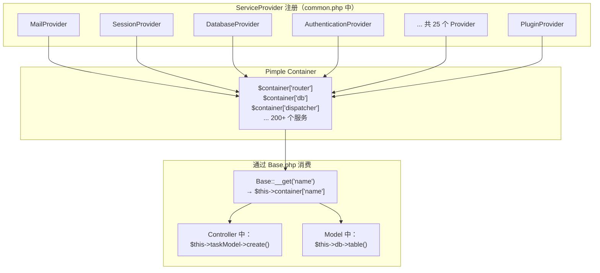

# 第二章：架构全景

## 2.1 目录结构总览

```
fork-kanboard/
├── app/                    # 🏗️ 核心应用代码
│   ├── Action/             # 51 个自动化动作实现
│   ├── Analytics/          # 数据分析计算
│   ├── Api/                # JSON-RPC API 层
│   │   ├── Authorization/  # API 权限检查（13 个类）
│   │   ├── Middleware/     # API 认证中间件
│   │   └── Procedure/     # API 过程处理（27 个类）
│   ├── Auth/               # 认证提供者（6 种方式）
│   ├── Console/            # CLI 命令（20+ 个）
│   ├── Controller/         # Web 控制器（94 个）
│   ├── Core/               # 框架核心
│   │   ├── Action/         # ActionManager
│   │   ├── Cache/          # 缓存驱动
│   │   ├── Controller/     # 控制器基类 + Runner
│   │   ├── Event/          # 事件管理
│   │   ├── ExternalLink/   # 外部链接管理
│   │   ├── ExternalTask/   # 外部任务管理
│   │   ├── Filter/         # 过滤器基础
│   │   ├── Group/          # 用户组管理
│   │   ├── Helper/         # 辅助工具
│   │   ├── Http/           # HTTP 路由、请求、响应
│   │   ├── Ldap/           # LDAP 集成
│   │   ├── Log/            # 日志
│   │   ├── Mail/           # 邮件客户端 + Transport
│   │   ├── ObjectStorage/  # 文件存储接口
│   │   ├── Plugin/         # 插件加载器、Hook、Schema
│   │   ├── Queue/          # 队列管理
│   │   ├── Security/       # 认证管理器、授权、角色
│   │   ├── Session/        # Session 管理
│   │   ├── Tool/           # 通用工具
│   │   ├── Translator/     # 国际化
│   │   ├── User/           # 用户会话、Profile、同步
│   │   └── Base.php        # ⭐ 所有类的基类（211 个魔术属性）
│   ├── Decorator/          # Model 装饰器（缓存层）
│   ├── Event/              # 事件数据类
│   ├── EventBuilder/       # 事件构建器
│   ├── Export/             # 导出功能
│   ├── Filter/             # 查询过滤器
│   ├── Formatter/          # 数据格式化器
│   ├── Group/              # 用户组工具
│   ├── Helper/             # 视图辅助函数
│   ├── Import/             # 导入功能
│   ├── Job/                # 后台任务定义
│   ├── Locale/             # 多语言翻译文件
│   ├── Middleware/          # Web 中间件（5 个）
│   ├── Model/              # 数据模型（79 个）
│   ├── Notification/       # 通知处理器（4 种）
│   ├── Pagination/         # 分页逻辑
│   ├── Schema/             # 数据库 Schema 定义
│   │   └── Sql/            # MySQL/PostgreSQL SQL 文件
│   ├── ServiceProvider/    # DI 服务提供者（25 个）
│   ├── Subscriber/         # 事件订阅者
│   ├── User/               # 用户相关工具
│   └── Validator/          # 数据校验器
├── cli/                    # CLI 入口
├── config.default.php      # 默认配置
├── data/                   # 运行时数据（数据库、文件）
├── docker/                 # Docker 配置
├── index.php               # Web 入口
├── jsonrpc.php             # API 入口
├── libs/                   # 第三方库（Minify、iCal、Captcha）
├── plugins/                # 插件目录
├── tests/                  # 测试套件
└── vendor/                 # Composer 依赖
```

### 各目录职责速查表

| 目录 | 职责 | 类数量 |
|------|------|--------|
| `app/Action/` | 自动化动作的具体实现（事件触发后执行的操作） | 51 |
| `app/Api/Procedure/` | JSON-RPC API 的具体方法实现 | 27 |
| `app/Api/Authorization/` | API 层的权限检查 | 13 |
| `app/Auth/` | 各种认证方式的提供者 | 6 |
| `app/Controller/` | Web 请求的控制器 | 94 |
| `app/Core/` | 框架基础设施（路由、HTTP、安全、Session、插件等） | ~60 |
| `app/Decorator/` | Model 的缓存装饰器 | 5 |
| `app/EventBuilder/` | 将 Model 数据构建成事件对象 | 6 |
| `app/Filter/` | 任务/项目等的查询过滤器 | ~20 |
| `app/Formatter/` | 将数据格式化为特定结构（API、Board、iCal等） | ~15 |
| `app/Job/` | 后台异步任务的定义 | 9 |
| `app/Middleware/` | Web 请求的中间件链 | 5 |
| `app/Model/` | 数据访问和业务逻辑 | 79 |
| `app/Notification/` | 通知的发送实现（邮件、Web、Webhook） | 4 |
| `app/ServiceProvider/` | Pimple DI 容器的服务注册 | 25 |
| `app/Subscriber/` | 事件订阅者（响应事件的处理逻辑） | ~10 |
| `app/Validator/` | 表单/数据校验 | ~15 |

---

## 2.2 系统分层方式

Kanboard 采用了一种**变体 MVC 架构**，与标准 MVC 的异同如下：



**与标准 MVC 的关键差异**：

| 方面 | 标准 MVC | Kanboard |
|------|----------|----------|
| Model 职责 | 纯数据访问 | 数据访问 **+** 业务逻辑 **+** 事件触发 |
| 中间件 | 无（通常由框架提供） | 自建 5 层中间件链 |
| 事件系统 | 可选 | **核心设计**——Model 操作自动触发事件 |
| Service 层 | 有 | 无——业务逻辑直接在 Model 中 |
| Repository 层 | 有 | 无——Model 直接操作数据库 |
| DI 方式 | 构造函数注入 | 魔术方法 `__get()` 从容器获取 |

**分层结构**：

1. **入口层**：`index.php` / `jsonrpc.php`
2. **中间件层**：Bootstrap → Authentication → Authorization（应用级 + 项目级）
3. **控制层**：Controller（接收请求、调用 Model、返回响应）
4. **模型层**：Model（数据库操作 + 业务逻辑 + 事件发布）
5. **事件层**：EventDispatcher → Subscriber / Action / Job
6. **基础设施层**：数据库、缓存、邮件、文件存储、插件

---

## 2.3 请求生命周期

### Web 请求时序图



### API 请求时序图



---

## 2.4 DI 容器机制

Kanboard 使用 **Pimple**（一个极简的 PHP DI 容器）管理所有依赖。

### 核心设计



### 工作方式

1. **注册阶段**：`common.php` 中按顺序注册 25 个 ServiceProvider，每个 Provider 在容器中注册若干服务
2. **惰性加载**：Pimple 的服务定义是闭包，只有首次访问时才实例化
3. **魔术属性**：所有继承 `Base` 的类都通过 `__get($name)` 魔术方法访问容器中的服务

**Base.php 的魔术方法**：
```php
// app/Core/Base.php
public function __get($name) {
    return $this->container[$name];
}
```

这意味着在任何 Controller、Model、Action 中，都可以直接写 `$this->taskModel`、`$this->db`、`$this->dispatcher` 等，它们会自动从容器中获取。`Base.php` 通过 `@property` 注解声明了 **211 个**魔术属性，涵盖所有 Model、Formatter、Validator、Job、Pagination 等。

---

## 2.5 路由注册方式

### 路由机制概述

Kanboard 的路由有两种模式：

**模式一：查询参数路由**（默认，`ENABLE_URL_REWRITE = false`）
```
/?controller=TaskViewController&action=show&task_id=1&project_id=2
```

**模式二：URL 重写路由**（`ENABLE_URL_REWRITE = true`）
```
/task/1
/project/2/board
```

### 路由注册

路由在 `app/ServiceProvider/RouteProvider.php` 中注册，共 **194 条路由**，涵盖：

| 路由分类 | 数量 | 示例 |
|----------|------|------|
| Dashboard | ~7 | `/dashboard/:user_id` |
| 项目管理 | ~30 | `/project/:project_id/board` |
| 任务操作 | ~40 | `/task/:task_id`, `/task/create/:project_id` |
| 看板视图 | ~10 | `/board/:project_id` |
| 分析报表 | ~7 | `/analytics/tasks/:project_id` |
| 管理后台 | ~30 | `/admin/users`, `/admin/plugins` |
| 认证 | ~5 | `/login`, `/logout` |
| 其他 | ~65 | 子任务、评论、文件、标签等 |

### 路由派发流程

`Router::dispatch()` 的工作方式：
1. 先检查 URL 查询参数中是否有 `controller` 和 `action`
2. 若无，则通过 `Route::findRoute()` 匹配 URL 模式
3. 清理参数（只允许字母数字和下划线）
4. 设置当前 Controller、Action、Plugin 名称
5. 默认值：Controller = `DashboardController`，Action = `show`

---

## 2.6 配置加载优先级

```mermaid
graph TD
    A["/data/config.php<br/>（最高优先级）"] --> B{是否存在?}
    B -->|是| C[加载]
    B -->|否| D["/config.php<br/>（次高优先级）"]
    D --> E{是否存在?}
    E -->|是| F[加载]
    E -->|否| G["config.default.php<br/>（默认值）"]
    G --> H[所有未定义的常量<br/>使用 defined() or define() 模式]
```

配置使用 PHP `define()` 常量，采用"先到先得"策略——先加载的文件中定义的常量优先，`config.default.php` 中的 `defined('X') or define('X', default)` 确保所有常量都有兜底值。

**主要配置分类**：
- 数据库连接（驱动、主机、端口、认证、SSL）
- 邮件发送（Transport 方式、SMTP 配置）
- LDAP 认证（服务器、绑定方式、用户/组同步）
- 安全策略（HSTS、X-Frame、CSRF、暴力破解防护）
- Session 管理（驱动、持续时间）
- API 配置（Token、Header）
- 插件与扩展
