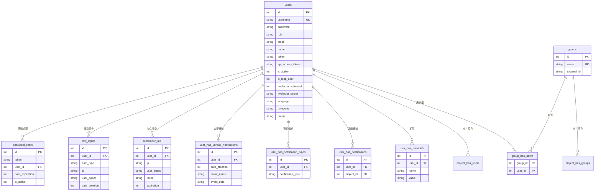
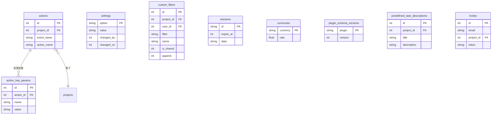

# 第三章：数据模型全景

> 本章展示 Kanboard 的数据库结构。按业务域分组的 ER 图描述表间静态关系，后附每张表的一句话说明。

---

## 3.1 项目域 ER 图

```mermaid
erDiagram
    projects ||--o{ columns : "拥有"
    projects ||--o{ swimlanes : "拥有"
    projects ||--o{ project_has_categories : "拥有"
    projects ||--o{ project_has_users : "关联"
    projects ||--o{ project_has_groups : "关联"
    projects ||--o{ project_has_roles : "定义"
    projects ||--o{ project_has_metadata : "扩展"
    projects ||--o{ project_has_notification_types : "配置"
    projects ||--o{ project_has_files : "附件"
    projects ||--o{ project_activities : "记录"
    projects ||--o{ project_daily_stats : "统计"
    projects ||--o{ project_daily_column_stats : "统计"
    projects ||--o{ actions : "配置"
    projects ||--o{ custom_filters : "保存"
    projects ||--o{ predefined_task_descriptions : "模板"
    projects ||--o{ invites : "邀请"
    projects ||--o{ tasks : "包含"
    projects ||--o{ tags : "定义"

    project_has_roles ||--o{ column_has_restrictions : "限制"
    project_has_roles ||--o{ column_has_move_restrictions : "限制"
    project_has_roles ||--o{ project_role_has_restrictions : "限制"

    columns ||--o{ column_has_restrictions : "被限制"
    columns ||--o{ column_has_move_restrictions : "被限制"
    columns ||--o{ project_daily_column_stats : "统计"

    projects {
        int id PK
        string name UK
        int is_active
        string token
        int owner_id FK
        string identifier
        int task_limit
    }

    columns {
        int id PK
        string title
        int position
        int project_id FK
        int task_limit
    }

    swimlanes {
        int id PK
        string name
        int position
        int is_active
        int project_id FK
        int task_limit
    }

    project_has_categories {
        int id PK
        string name
        int project_id FK
        string color_id
    }

    project_has_users {
        int id PK
        int project_id FK
        int user_id FK
        string role
    }

    project_has_groups {
        int id PK
        int project_id FK
        int group_id FK
        string role
    }

    project_has_roles {
        int id PK
        int project_id FK
        string role
    }

    project_has_metadata {
        int id PK
        int project_id FK
        string name
        string value
    }
```

---

## 3.2 任务域 ER 图

```mermaid
erDiagram
    tasks ||--o{ task_has_subtasks : "拥有"
    tasks ||--o{ comments : "拥有"
    tasks ||--o{ task_has_files : "附件"
    tasks ||--o{ task_has_links : "关联"
    tasks ||--o{ task_has_external_links : "外部链接"
    tasks ||--o{ task_has_tags : "标签"
    tasks ||--o{ task_has_metadata : "扩展"
    tasks ||--o{ transitions : "流转记录"

    task_has_subtasks ||--o{ subtask_time_tracking : "时间追踪"

    tags ||--o{ task_has_tags : "被引用"
    links ||--o{ task_has_links : "定义类型"

    tasks {
        int id PK
        string title
        string description
        int date_creation
        int date_completed
        int date_due
        int date_started
        int color_id
        int project_id FK
        int column_id FK
        int swimlane_id FK
        int owner_id FK
        int creator_id FK
        int position
        int is_active
        int score
        int priority
        int category_id FK
        int recurrence_status
        string reference
        string external_provider
        string external_uri
        float time_estimated
        float time_spent
    }

    task_has_subtasks {
        int id PK
        string title
        int status
        int time_estimated
        int time_spent
        int task_id FK
        int user_id FK
        int position
    }

    comments {
        int id PK
        int task_id FK
        int user_id FK
        string comment
        int date_creation
        int date_modification
        string reference
        string visibility
    }

    task_has_files {
        int id PK
        string name
        string path
        int is_image
        int size
        int task_id FK
        int user_id FK
        int date
    }

    task_has_links {
        int id PK
        int link_id FK
        int task_id FK
        int opposite_task_id FK
    }

    task_has_external_links {
        int id PK
        int task_id FK
        string link_type
        string dependency
        string title
        string url
        int creator_id FK
    }

    tags {
        int id PK
        string name
        int project_id FK
        string color_id
    }

    task_has_tags {
        int id PK
        int task_id FK
        int tag_id FK
    }

    links {
        int id PK
        string label
        int opposite_id
    }

    transitions {
        int id PK
        int user_id FK
        int project_id FK
        int task_id FK
        int src_column_id FK
        int dst_column_id FK
        int date
        int time_spent
    }

    subtask_time_tracking {
        int id PK
        int subtask_id FK
        int user_id FK
        int start
        int end
        float time_spent
    }

    task_has_metadata {
        int id PK
        int task_id FK
        string name
        string value
    }
```

---

## 3.3 用户与权限域 ER 图

---

## 3.4 自动化与配置域 ER 图

---

## 3.5 全表速查表

### 项目域（16 张表）

| 表名 | 职责 |
|------|------|
| `projects` | 项目主表，存储名称、状态、标识符、任务限制等项目级配置 |
| `columns` | 看板列定义，每个项目有多个列（如 Backlog、In Progress、Done） |
| `swimlanes` | 泳道定义，可为看板添加横向分组维度 |
| `project_has_categories` | 项目内的任务分类（如 Bug、Feature），支持颜色标记 |
| `project_has_users` | 用户与项目的关联及其项目角色（Manager/Member/Viewer） |
| `project_has_groups` | 用户组与项目的关联及角色 |
| `project_has_roles` | 项目自定义角色定义 |
| `project_has_metadata` | 项目的 Key-Value 扩展字段 |
| `project_has_notification_types` | 项目级通知类型配置 |
| `project_has_files` | 项目级文件附件 |
| `project_activities` | 项目活动流水日志（审计跟踪） |
| `project_daily_stats` | 每日项目统计（平均 Lead Time、Cycle Time） |
| `project_daily_column_stats` | 每日各列任务数量统计（用于 CFD 图） |
| `column_has_restrictions` | 按自定义角色限制列的操作权限 |
| `column_has_move_restrictions` | 按角色限制任务在列间的移动规则 |
| `project_role_has_restrictions` | 自定义项目角色的全局限制规则 |

### 任务域（12 张表）

| 表名 | 职责 |
|------|------|
| `tasks` | 任务主表，存储标题、描述、日期、状态、位置、优先级等所有任务属性 |
| `task_has_subtasks` | 子任务，支持状态跟踪和时间估算 |
| `subtask_time_tracking` | 子任务的计时记录（开始/结束/耗时） |
| `comments` | 任务评论，支持可见性控制 |
| `task_has_files` | 任务附件（文件/图片） |
| `task_has_links` | 任务间关系（阻塞、关联、子任务、里程碑等） |
| `links` | 关系类型定义（如"blocks / is blocked by"） |
| `task_has_external_links` | 任务与外部系统的链接 |
| `task_has_tags` | 任务与标签的多对多关联 |
| `tags` | 标签定义，可按项目隔离 |
| `task_has_metadata` | 任务的 Key-Value 扩展字段 |
| `transitions` | 任务在列间移动的历史记录（用于 Cycle Time 计算） |

### 用户与权限域（10 张表）

| 表名 | 职责 |
|------|------|
| `users` | 用户主表，含认证信息、角色、偏好设置、2FA 配置 |
| `groups` | 用户组（可与 LDAP 同步） |
| `group_has_users` | 用户组成员关系 |
| `user_has_metadata` | 用户的 Key-Value 扩展字段 |
| `user_has_notifications` | 用户的项目通知订阅 |
| `user_has_notification_types` | 用户的通知渠道偏好（邮件/Web） |
| `user_has_unread_notifications` | 用户的未读通知队列 |
| `remember_me` | RememberMe 持久登录 Token |
| `last_logins` | 登录历史记录（认证方式、IP、时间） |
| `password_reset` | 密码重置 Token |

### 自动化与配置域（9 张表）

| 表名 | 职责 |
|------|------|
| `actions` | 自动化规则定义（项目 + 事件 + 动作类名） |
| `action_has_params` | 自动化规则的参数配置 |
| `settings` | 全局应用配置（Key-Value） |
| `custom_filters` | 用户保存的任务过滤器 |
| `sessions` | 数据库 Session 存储（可选） |
| `currencies` | 汇率配置 |
| `invites` | 项目邀请 Token |
| `plugin_schema_versions` | 插件的数据库版本追踪 |
| `predefined_task_descriptions` | 预定义的任务描述模板 |

---

## 3.6 关键数据特征

- **总表数**：约 51 张（含关联表）
- **Metadata 模式**：`user_has_metadata`、`project_has_metadata`、`task_has_metadata` 三张 Key-Value 表提供灵活的字段扩展能力
- **外键约束**：广泛使用 `ON DELETE CASCADE` 确保引用完整性
- **唯一约束**：`projects.name`、`users.username`、`links.label`、`(project_id, name)` 等
- **性能索引**：20+ 个索引覆盖常用查询路径
- **Schema 版本**：MySQL 139 / PostgreSQL 117 / SQLite 128——三种数据库的迁移脚本独立维护，版本号不可跨数据库比较（各自的 version_1 内容不同），MySQL 的版本号最大是因为其迁移步骤拆分得更细
