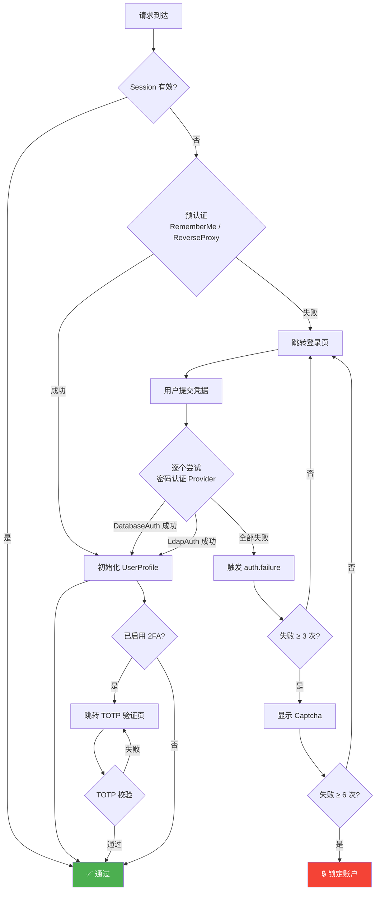
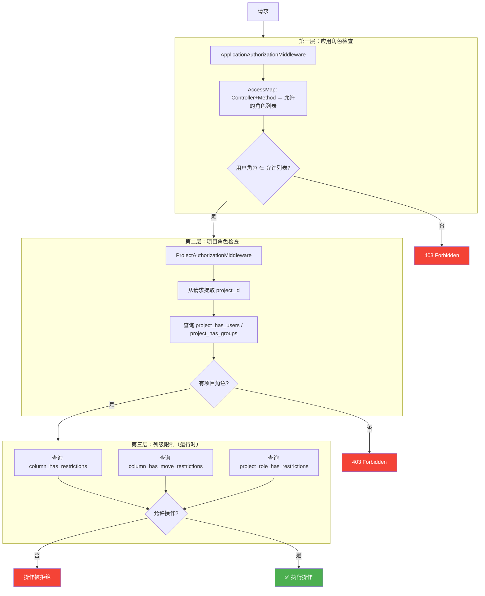
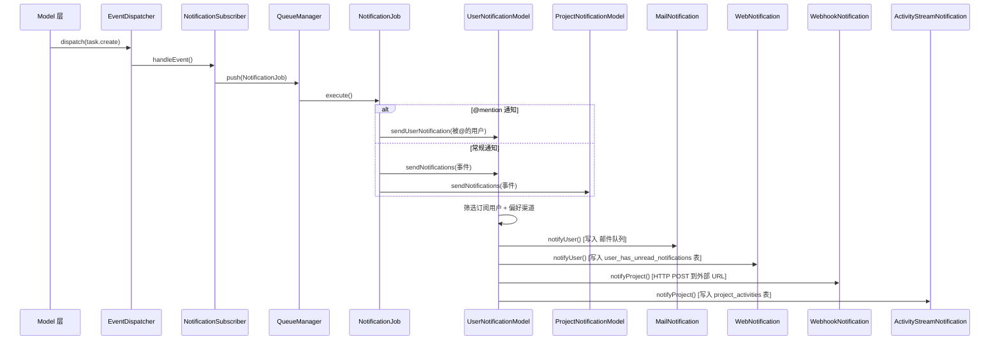

# 第四章：核心机制

> 本章概述 Kanboard 后端的七大核心机制。每个机制用一段话说明"怎么工作"，配一张图展示关键流转。

---

## 4.1 认证系统

### 概述

Kanboard 支持 **6 种认证方式**，由 `AuthenticationManager`（位于 `app/Core/Security/`）统一编排。每种方式实现特定的 Provider 接口：Database 和 LDAP 实现密码认证接口，RememberMe 实现预认证接口，ReverseProxy 实现预认证接口，TOTP 实现后置认证接口用于二次验证，ApiAccessToken 实现密码认证接口但仅在 API 作用域下生效。认证过程遵循"先检查 Session → 再尝试预认证 → 再进行密码认证 → 最后后置认证"的链式流程。认证成功会触发 `auth.success` 事件，由 `AuthSubscriber` 记录登录历史并创建 RememberMe Session；失败则触发 `auth.failure`，累计失败次数达到阈值会启用 Captcha（3 次）或锁定账户（6 次）。

**关键文件**：`app/Core/Security/AuthenticationManager.php`、`app/Auth/` 下 6 个 Provider、`app/Subscriber/AuthSubscriber.php`

---

## 4.2 权限控制

### 概述

Kanboard 实现了**三层权限体系**。第一层是**应用角色**（App Role），分为 `APP_ADMIN`（管理员）、`APP_MANAGER`（经理）、`APP_USER`（普通用户）三级，通过 `AccessMap` 映射到 Controller 的方法级别。第二层是**项目角色**（Project Role），分为 `PROJECT_MANAGER`、`PROJECT_MEMBER`、`PROJECT_VIEWER` 三级，加上支持自定义角色，通过 `project_has_users` 和 `project_has_groups` 表维护关联。第三层是**列级限制**（Column Restriction），可以针对自定义项目角色，限制其在特定列中的操作权限或列间移动权限。三层检查分别由 `ApplicationAuthorizationMiddleware`、`ProjectAuthorizationMiddleware` 和 Model 层的限制查询来执行。

**关键文件**：`app/Core/Security/AccessMap.php`、`app/Core/Security/Authorization.php`、`app/Core/Security/Role.php`、`app/Middleware/ApplicationAuthorizationMiddleware.php`、`app/Middleware/ProjectAuthorizationMiddleware.php`、`app/Model/ProjectUserRoleModel.php`、`app/Model/ColumnRestrictionModel.php`

---

## 4.3 事件系统

### 概述

Kanboard 基于 **Symfony EventDispatcher** 构建了贯穿全系统的事件机制。事件由 Model 层在数据变更时发布（如 `task.create`、`task.move.column`、`comment.create` 等），通过 `EventBuilder` 类将 Model 数据构建成标准的事件对象（`TaskEvent`、`CommentEvent` 等）。事件的消费方有三类：**Subscriber**（全局订阅者，如通知、转场记录、项目时间戳更新）、**Action**（项目级自动化规则）、**Plugin**（插件注册的监听器）。所有事件常量定义在对应的 Model 类中（如 `TaskModel::EVENT_CREATE`），共涵盖 20+ 种事件类型。

```mermaid
flowchart LR
    subgraph 事件发布者
        M1[TaskCreationModel]
        M2[TaskPositionModel]
        M3[TaskStatusModel]
        M4[CommentModel]
        M5[SubtaskModel]
        M6[AuthenticationManager]
    end

    subgraph EventDispatcher["Symfony EventDispatcher"]
        EB[EventBuilder<br/>构建事件数据]
        DISP[dispatch&#40;event&#41;]
    end

    subgraph 事件消费者
        S1[NotificationSubscriber<br/>→ 推送通知]
        S2[TransitionSubscriber<br/>→ 记录列转场]
        S3[ProjectModificationDateSubscriber<br/>→ 更新项目时间]
        S4[RecurringTaskSubscriber<br/>→ 创建重复任务]
        S5[AuthSubscriber<br/>→ 登录追踪]
        A1[ActionManager<br/>→ 51 个自动化动作]
        P1[Plugin 监听器]
    end

    M1 --> EB
    M2 --> EB
    M3 --> EB
    M4 --> EB
    M5 --> EB
    M6 --> EB
    EB --> DISP
    DISP --> S1
    DISP --> S2
    DISP --> S3
    DISP --> S4
    DISP --> S5
    DISP --> A1
    DISP --> P1
```

**关键文件**：`app/Event/` 下的事件类、`app/EventBuilder/` 下的构建器、`app/Subscriber/` 下的订阅者、`app/Core/Action/ActionManager.php`

---

## 4.4 通知系统

### 概述

通知系统由事件驱动：当 `NotificationSubscriber` 收到事件后，将 `NotificationJob` 推入队列。Job 执行时根据用户的通知偏好和项目的通知配置，筛选出需要通知的用户和渠道。系统内置四种通知渠道——**邮件通知**（通过 SMTP/Sendmail 发送）、**Web 通知**（写入 `user_has_unread_notifications` 表在界面显示）、**Webhook 通知**（向配置的 URL 发送 HTTP POST）、**活动流通知**（写入 `project_activities` 表）。用户可以按项目订阅通知，也可以选择接收哪些类型的通知和通过哪个渠道接收。此外，评论和任务描述中的 `@mention` 会触发专门的 mention 通知。

**关键文件**：`app/Subscriber/NotificationSubscriber.php`、`app/Job/NotificationJob.php`、`app/Notification/` 下 4 个通知实现、`app/Model/UserNotificationModel.php`、`app/Model/ProjectNotificationModel.php`

---

## 4.5 自动化动作

### 概述

Kanboard 的自动化系统允许用户为项目配置"当 X 事件发生时，自动执行 Y 动作"的规则。规则存储在 `actions` 和 `action_has_params` 表中，系统启动时由 `ActionManager` 从数据库加载所有规则并注册到 EventDispatcher。当事件触发时，每个匹配的 Action 依次检查：事件是否兼容 → 项目是否匹配 → 参数是否满足 → 条件是否成立，全部通过后执行 `doAction()`。系统内置 **51 个 Action**，覆盖任务分配、颜色变更、状态变更、列移动、评论创建、邮件发送等场景。为防止递归（Action 执行可能触发新事件再触发新 Action），系统通过调用栈跟踪机制阻止循环调用。

```mermaid
flowchart TD
    START[系统启动] --> LOAD[ActionManager::attachEvents<br/>从 actions 表加载所有规则]
    LOAD --> REG[为每条规则注册事件监听器]

    EVT[事件触发<br/>如 task.move.column] --> CHECK1{事件类型兼容?}
    CHECK1 -->|否| SKIP[跳过]
    CHECK1 -->|是| CHECK2{project_id 匹配?}
    CHECK2 -->|否| SKIP
    CHECK2 -->|是| CHECK3{必需参数满足?}
    CHECK3 -->|否| SKIP
    CHECK3 -->|是| CHECK4{业务条件成立?<br/>如: 源列 = 指定列}
    CHECK4 -->|否| SKIP
    CHECK4 -->|是| EXEC[执行 doAction&#40;&#41;<br/>如: 关闭任务 / 分配用户]
    EXEC --> RESULT[操作完成<br/>可能触发新事件]
    RESULT --> GUARD{调用栈检测<br/>是否递归?}
    GUARD -->|是| BLOCK[阻止执行]
    GUARD -->|否| EVT

    style EXEC fill:#2196F3,color:white
    style BLOCK fill:#f44336,color:white
```

**内置 Action 分类速览**：

| 分类 | 数量 | 示例 |
|------|------|------|
| 任务分配 | ~8 | 分配给当前用户、指定用户、创建者 |
| 颜色变更 | ~8 | 按分类、列、优先级、到期日自动变色 |
| 状态变更 | ~5 | 移到指定列自动关闭、不活跃自动关闭 |
| 列移动 | ~6 | 按分配人、日期、分类自动移动 |
| 评论创建 | ~2 | 列移动时自动添加评论 |
| 任务创建 | ~3 | 自动创建任务、设置到期日 |
| 其他 | ~19 | 邮件通知、计时器控制、泳道移动等 |

**关键文件**：`app/Core/Action/ActionManager.php`、`app/Action/Base.php`（抽象基类）、`app/Action/` 下 51 个具体实现、`app/Model/ActionModel.php`

---

## 4.6 插件系统

### 概述

Kanboard 的插件系统通过 `PluginLoader`（位于 `app/Core/Plugin/`）扫描 `/plugins/` 目录下的子文件夹来发现插件。每个插件需要有一个继承 `Kanboard\Core\Plugin\Base` 的 `Plugin.php` 主类。加载过程依次执行：版本兼容性检查、数据库 Schema 迁移、DI 容器注册、Hook 注册和初始化。插件可以通过 Hook 系统（支持 `merge`、`first`、`reference` 三种调用模式）在预定义的扩展点注入逻辑，也可以注册新的 Controller、Model、Helper 到 DI 容器中。此外，插件可以监听 `app.bootstrap` 事件在应用启动时执行逻辑，也可以通过 Schema 机制管理自己的数据库表。

```mermaid
flowchart TD
    SCAN[PluginLoader::scan&#40;&#41;<br/>扫描 /plugins/ 目录] --> EACH[遍历每个插件目录]

    EACH --> LOAD[加载 Plugin.php 主类]
    LOAD --> VER{版本兼容?}
    VER -->|否| INCOMPAT[加入不兼容列表]
    VER -->|是| SCHEMA[SchemaHandler: 运行数据库迁移]
    SCHEMA --> BOOT[注册 app.bootstrap 事件监听]
    BOOT --> DIC[注册类到 DI 容器<br/>getClasses&#40;&#41; / getHelpers&#40;&#41;]
    DIC --> INIT[调用 initialize&#40;&#41;<br/>注册路由、Hook、事件监听]
    INIT --> DONE[插件就绪 ✅]

    subgraph 插件可用的扩展点
        H1[Hook 系统<br/>在模板/逻辑中插入内容]
        H2[EventDispatcher<br/>监听/发布事件]
        H3[路由注册<br/>添加新的 URL 映射]
        H4[DI 容器<br/>注册新的 Service]
        H5[数据库<br/>创建/迁移自定义表]
    end

    DONE --> H1
    DONE --> H2
    DONE --> H3
    DONE --> H4
    DONE --> H5

    style DONE fill:#4CAF50,color:white
    style INCOMPAT fill:#FF9800,color:white
```

**关键文件**：`app/Core/Plugin/Loader.php`、`app/Core/Plugin/Base.php`、`app/Core/Plugin/Hook.php`、`app/Core/Plugin/SchemaHandler.php`、`app/Core/Plugin/Version.php`

---

## 4.7 API 系统

### 概述

Kanboard 提供基于 **JSON-RPC 2.0** 协议的 API，入口为 `jsonrpc.php`。API 使用 `JsonRPC\Server` 库处理请求解析和响应序列化。认证支持两种方式：**用户凭据认证**（用户名 + 密码，通过 HTTP Header 传递）和**应用 Token 认证**（用户名设为 `jsonrpc`，密码为配置文件中的 API Token）。启用 2FA 的用户需要使用 `api_access_token` 替代密码。API 层有独立的权限检查体系——`app/Api/Authorization/` 下的 13 个授权类对应不同的资源域（项目、任务、评论等），确保用户只能操作自己有权限的资源。API 注册了 **27 个 Procedure 类**，涵盖项目、任务、列、泳道、评论、子任务、标签、用户、用户组等全部业务域。

```mermaid
flowchart TD
    REQ["POST /jsonrpc.php<br/>Header: X-API-Auth<br/>Body: JSON-RPC 2.0"] --> PARSE[JsonRPC Server 解析请求]

    PARSE --> AUTH[API AuthenticationMiddleware]

    AUTH --> CRED{用户名?}
    CRED -->|jsonrpc| TOKEN[验证应用级 API Token<br/>hash_equals 比对]
    CRED -->|其他| USER[验证用户凭据]

    USER --> LOCKED{账户锁定?}
    LOCKED -->|是| FAIL[❌ 认证失败]
    LOCKED -->|否| TWOFA{启用 2FA?}
    TWOFA -->|是| APITOKEN[使用 ApiAccessTokenAuth<br/>验证 api_access_token]
    TWOFA -->|否| DBAUTH[使用 DatabaseAuth/LdapAuth<br/>验证密码]

    TOKEN --> DISPATCH
    APITOKEN --> DISPATCH
    DBAUTH --> DISPATCH

    DISPATCH[匹配 Procedure 方法] --> BEFORE[beforeProcedure&#40;&#41; Hook]
    BEFORE --> AUTHZ[权限检查<br/>ProjectAuthorization 等]
    AUTHZ --> EXECUTE[执行业务逻辑<br/>通过 Model 层]
    EXECUTE --> RESP["返回 JSON-RPC 2.0 响应<br/>{result: ...}"]

    style FAIL fill:#f44336,color:white
    style RESP fill:#4CAF50,color:white
```

**27 个 Procedure 类**：

| Procedure | 操作的资源 |
|-----------|-----------|
| `ProjectProcedure` | 项目 CRUD |
| `TaskProcedure` | 任务 CRUD |
| `BoardProcedure` | 看板数据获取 |
| `ColumnProcedure` | 列管理 |
| `SwimlaneProcedure` | 泳道管理 |
| `CategoryProcedure` | 分类管理 |
| `CommentProcedure` | 评论 CRUD |
| `SubtaskProcedure` | 子任务 CRUD |
| `SubtaskTimeTrackingProcedure` | 子任务计时 |
| `TaskFileProcedure` | 任务文件管理 |
| `ProjectFileProcedure` | 项目文件管理 |
| `TaskLinkProcedure` | 任务间链接 |
| `LinkProcedure` | 链接类型管理 |
| `TaskExternalLinkProcedure` | 外部链接管理 |
| `TaskTagProcedure` | 任务标签 |
| `TagProcedure` | 标签管理 |
| `TaskMetadataProcedure` | 任务元数据 |
| `ProjectMetaDataProcedure` | 项目元数据 |
| `UserProcedure` | 用户管理 |
| `GroupProcedure` | 用户组管理 |
| `GroupMemberProcedure` | 组成员管理 |
| `ProjectPermissionProcedure` | 项目权限 |
| `ActionProcedure` | 自动化规则 |
| `AppProcedure` | 应用信息 |
| `MeProcedure` | 当前用户操作 |

**关键文件**：`jsonrpc.php`、`app/ServiceProvider/ApiProvider.php`、`app/Api/Middleware/AuthenticationMiddleware.php`、`app/Api/Procedure/` 下 27 个类、`app/Api/Authorization/` 下 13 个类
