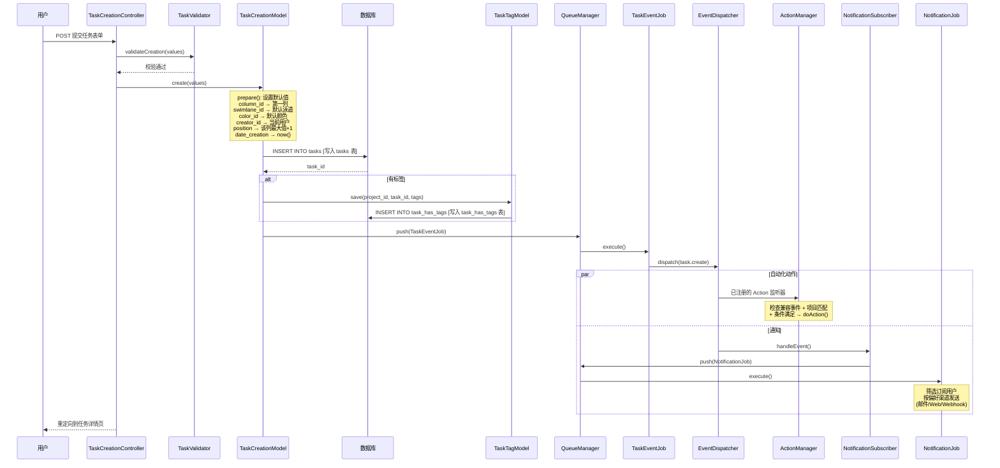
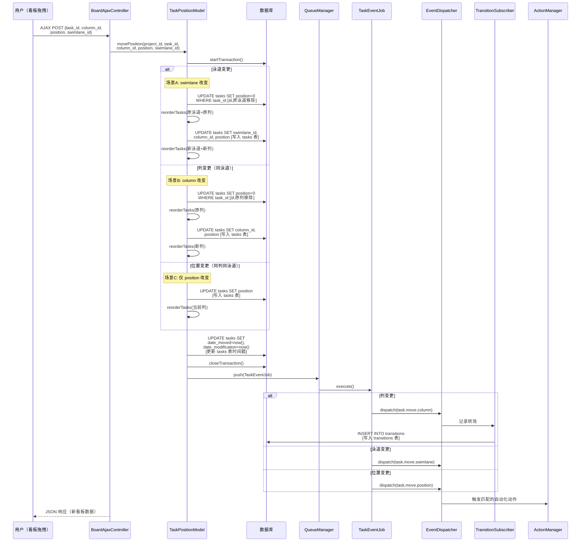
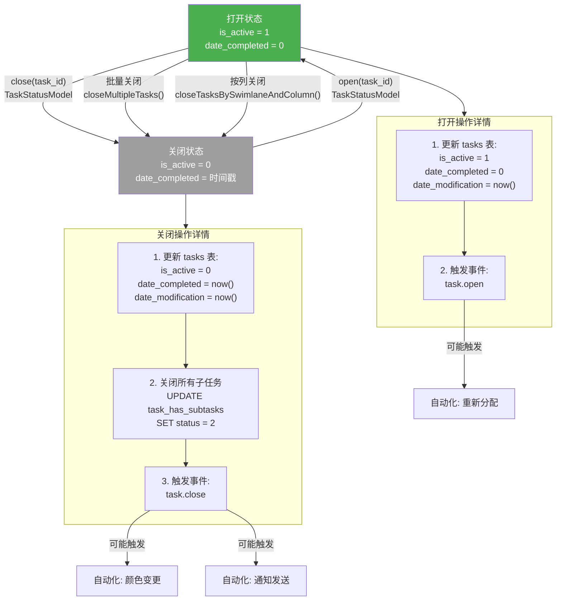
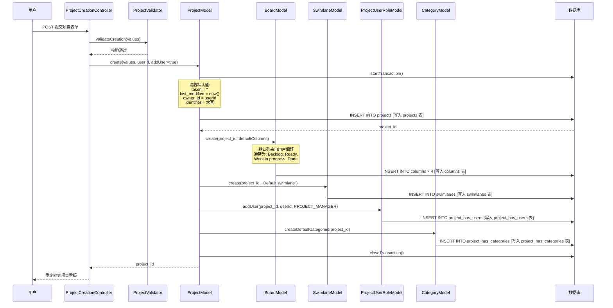
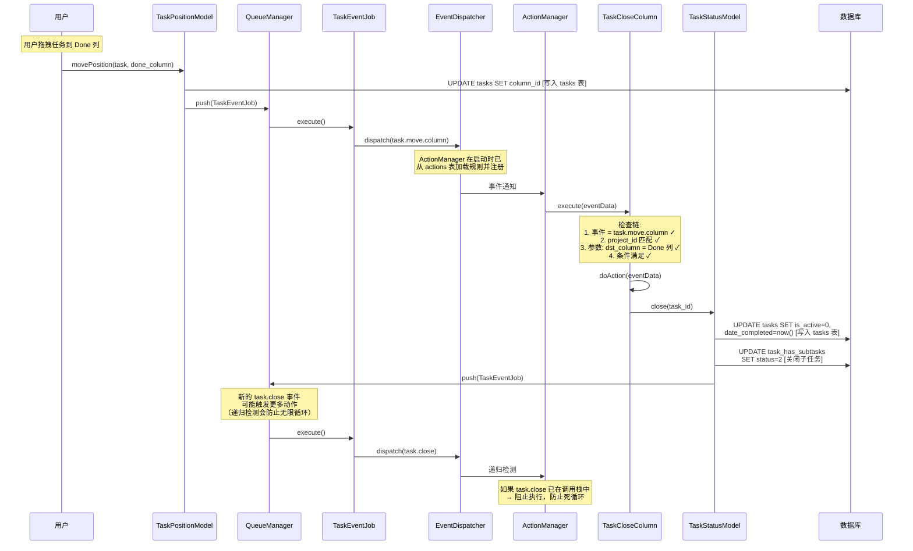
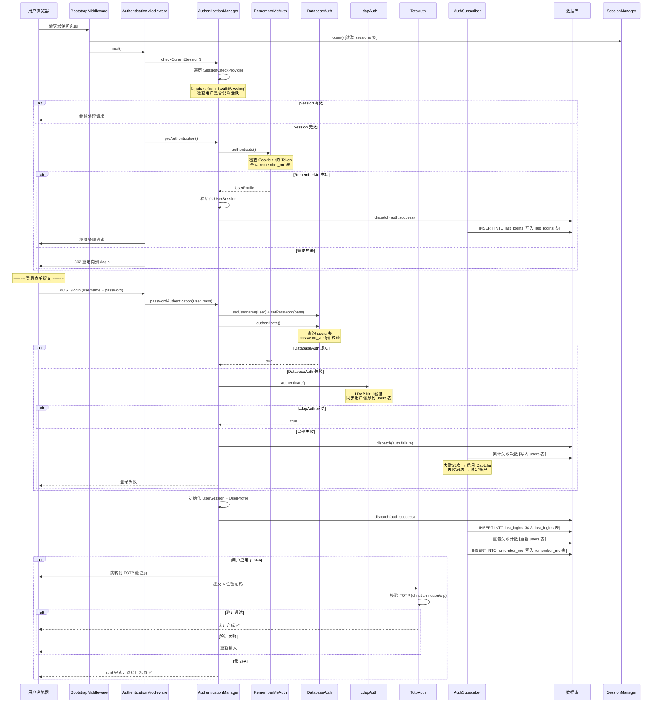

# 第五章：业务流程

> **本章是全书的核心。** 通过 6 张流程图展示 Kanboard 最关键的业务链路，每张图标注涉及的数据表和关键类名。

---

## 5.1 任务创建流程

> 从表单提交到任务入库、事件触发、自动化执行、通知发送的完整链路。

**要点说明**：
- 任务创建时会自动填充大量默认值（列位置、泳道、颜色、创建时间等），见 `TaskCreationModel::prepare()` 方法
- 事件通过 `QueueManager` 异步推送，`TaskEventJob` 负责实际触发 `task.create` 和 `task.create_update` 两个事件
- Hook 扩展点 `model:task:creation:aftersave` 允许插件在任务创建后执行自定义逻辑

---

## 5.2 任务在看板上拖拽移动

> 用户在看板上拖拽任务卡片到另一列或另一泳道时的完整后端处理流程。

**要点说明**：
- 整个移动操作在数据库事务中执行，任何失败都会回滚
- `reorderTasks()` 确保同一列/泳道中的所有任务位置连续无间隙
- 列变更会写入 `transitions` 表，这是计算 Cycle Time 和 Lead Time 的数据基础
- 移动事件会触发自动化动作（如"移到 Done 列自动关闭任务"）

---

## 5.3 任务状态流转

> 任务的打开、关闭、归档状态变化，以及涉及的字段变更。

**要点说明**：
- Kanboard 的任务状态模型很简单：只有"打开"（`is_active=1`）和"关闭"（`is_active=0`）两个状态
- 关闭任务时会同时关闭所有未完成的子任务
- `date_completed` 在关闭时设为当前时间戳，重新打开时清零
- 没有独立的"归档"状态——关闭即为最终状态，项目级别有归档功能（`projects.is_active=0`）

---

## 5.4 项目创建流程

> 创建项目时自动初始化默认列、默认泳道和权限的完整事务流程。

**要点说明**：
- 整个创建过程在一个数据库事务中，任何步骤失败都会回滚
- 默认列名可由用户在设置中自定义，通过 `BoardModel::getUserColumns()` 获取
- 创建者自动被设为项目的 `PROJECT_MANAGER` 角色
- 默认分类从全局设置中读取并批量创建

---

## 5.5 自动化动作触发流程

> 展示一个具体场景：当任务移动到"Done"列时，自动关闭任务。

**要点说明**：
- Action 的规则配置存储在 `actions` 表（事件名 + 动作类名）和 `action_has_params` 表（参数如目标列 ID）
- `ActionManager::attachEvents()` 在应用启动时被调用，将所有 Action 注册为 EventDispatcher 的监听器
- 递归防护通过跟踪调用栈中已处理的事件来实现——如果检测到同一 Action 已在执行，则跳过

---

## 5.6 用户认证流程

> 完整的 Web 登录认证流程，包含 Session 检查、预认证、密码验证、2FA 和暴力破解防护。

**要点说明**：
- 密码认证按顺序尝试 Provider（先 Database、再 LDAP），第一个成功即停止
- `AuthSubscriber` 负责所有认证相关的副作用：记录登录历史、管理 RememberMe Token、累计/重置失败计数
- 暴力破解防护通过两个阈值实现：3 次失败启用 Captcha（`BRUTEFORCE_CAPTCHA`），6 次失败锁定账户（`BRUTEFORCE_LOCKDOWN`）
- 2FA 验证是独立的后置认证步骤，只在用户启用 `twofactor_activated` 时触发
