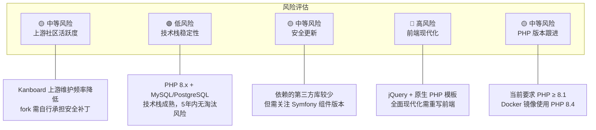

# 第七章：采用决策

---

## 7.1 适合的场景

| 场景 | 为什么适合 |
|------|-----------|
| **小团队（5-20 人）的任务看板** | 功能完备、部署简单（Docker 一键启动）、SQLite 零配置 |
| **需要自托管的组织** | 数据完全掌控，支持内网部署，无外部依赖 |
| **流程自动化需求** | 51 个内置自动化动作 + 灵活的事件系统，可无代码配置 |
| **API 集成场景** | JSON-RPC API 覆盖所有业务域，可作为后端任务引擎被其他系统调用 |
| **PHP 技术栈团队** | 纯 PHP 项目，PHP 开发者可快速理解和二次开发 |
| **轻量部署环境** | 资源占用小，一个 PHP 进程 + SQLite 即可运行 |

## 7.2 不适合的场景

| 场景 | 为什么不适合 |
|------|-------------|
| **大型团队（100+ 人）** | 无工作空间/多租户隔离、无高级权限管理（如字段级权限） |
| **需要现代化前端体验** | 前端基于 jQuery + 原生 PHP 模板，不支持实时协作、拖拽体验有限 |
| **需要 RESTful API** | API 采用 JSON-RPC 协议，不符合 REST 规范，与现代前端框架集成不便 |
| **复杂项目管理（如 Scrum）** | 无 Sprint 管理、无 Story Point 燃尽图、无路线图功能 |
| **需要丰富的第三方集成** | 插件生态相对小众，不如 Jira/Trello 有丰富的 Marketplace |
| **高并发场景** | PHP-FPM 同步模型 + 无连接池，高并发下性能受限 |

---

## 7.3 长期维护风险

**关键风险总结**：
- **社区风险**：作为 fork 项目，需要独立承担安全修复和功能演进的责任
- **技术债务风险**：前端技术栈陈旧是最大的长期隐患，但如果只关注后端 API 使用则影响较小
- **依赖风险**：Symfony Console/EventDispatcher 已锁定 5.4 版本（LTS），Pimple 已稳定不再更新

---

## 7.4 同类开源项目对比

| 特性 | **Kanboard** | **Wekan** | **Taiga** | **Focalboard** |
|------|:------------:|:---------:|:---------:|:---------------:|
| **语言** | PHP | Node.js (Meteor) | Python (Django) | Go + React |
| **数据库** | SQLite/MySQL/PG | MongoDB | PostgreSQL | PostgreSQL/SQLite |
| **API 风格** | JSON-RPC | REST | REST | REST |
| **前端** | jQuery + PHP模板 | Blaze/React | Angular | React |
| **看板** | ✅ | ✅ | ✅ | ✅ |
| **Scrum 支持** | ❌ | ❌ | ✅ | 部分 |
| **自动化** | ⭐⭐⭐⭐⭐ (51个) | ⭐⭐ | ⭐⭐⭐ | ⭐⭐ |
| **插件系统** | ✅ 完善 | ✅ 基础 | ✅ 完善 | ❌ |
| **资源占用** | 🟢 极低 | 🔴 高 | 🟡 中等 | 🟢 低 |
| **部署难度** | 🟢 简单 | 🟡 中等 | 🟡 中等 | 🟢 简单 |
| **社区活跃度** | 🟡 中等 | 🟡 中等 | 🟡 中等 | 🟢 活跃 |
| **适合规模** | 小-中 | 小-中 | 中 | 小-中 |
| **许可证** | MIT | MIT | AGPL | AGPL/MIT |

### 选择建议

- **选 Kanboard**：如果你需要一个极轻量、自动化能力强、PHP 生态友好的看板工具，尤其是作为后端任务管理引擎通过 API 集成
- **选 Wekan**：如果你熟悉 Node.js 生态，需要类 Trello 的体验
- **选 Taiga**：如果你需要 Scrum + Kanban 混合模式，接受 Python 技术栈
- **选 Focalboard**：如果你需要现代化的前端体验，或者使用 Mattermost 生态

---

## 7.5 最终决策矩阵

> 根据你的实际情况打分，选择总分最高的方案。

| 决策因素 | 权重 | Kanboard 表现 | 评分 (1-5) |
|----------|:----:|---------------|:----------:|
| 部署和维护简单 | 高 | Docker 一键部署，SQLite 零配置 | 5 |
| 自动化能力 | 高 | 51 个内置 Action，可扩展 | 5 |
| API 集成能力 | 中 | JSON-RPC 全覆盖，但非 REST | 3 |
| 二次开发难度 | 中 | PHP + 清晰架构，Model 过重 | 3 |
| 前端用户体验 | 低-中 | 功能完备但技术栈陈旧 | 2 |
| 多租户/大规模 | 低 | 单租户设计，无水平扩展 | 1 |
| 长期可维护性 | 中 | 依赖少但需自行维护 fork | 3 |
| 安全性 | 高 | 多重认证 + 暴力破解防护 + LDAP | 4 |

**加权得分**：适合小中型团队自托管看板 + API 集成的场景，不适合作为企业级项目管理平台。
